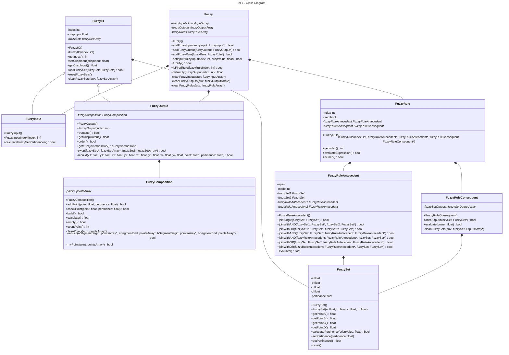

# Class Diagram

```mermaid
---
title: eFLL Class Diagram
---
classDiagram
    class FuzzyInput {
        +FuzzyInput()
        +FuzzyInputIndex(index: int)
        +calculateFuzzySetPertinences() bool
    }
    class FuzzyIO {
        -index int
        -crispInput float
        -fuzzySets fuzzySetArray*
        +FuzzyIO()
        +FuzzyIO(index: int)
        +getIndex() int
        +setCrispInput(crispInput: float)
        +getCrispInput() float
        +addFuzzySet(fuzzySet: FuzzySet*) bool
        +resetFuzzySets()
        -cleanFuzzySets(aux: fuzzySetArray*)
    }
    class FuzzySet {
        -a float
        -b float
        -c float
        -d float
        -pertinance float
        +FuzzySet()
        +FuzzySet(a: float, b: float, c: float, d: float)
        +getPointA() float
        +getPointB() float
        +getPointC() float
        +getPointD() float
        +calculatePertinence(crispValue: float) bool
        +setPertinence(pertinence: float)
        +getPertinence() float
        +reset()
    }
    class FuzzyOutput {
        -fuzzyComposition FuzzyComposition*
        +FuzzyOutput()
        +FuzzyOutput(index: int)
        +truncate() bool
        +getCrispOutput() float
        +order() bool
        +getFuzzyComposition() FuzzyComposition*
        -swap(fuzzySetA: fuzzySetArray*, fuzzySetB: fuzzySetArray*) bool
        -rebuild(x1: float, y1: float, x2: float, y2: float, x3: float, y3: float, x4: float, y4: float, point: float*, pertinence: float*) bool
    }
    class FuzzyComposition {
        -points: pointsArray*
        +FuzzyComposition()
        +addPoint(point: float, pertinence: float) bool
        +checkPoint(point: float, pertinence: float) bool
        +build() bool
        +calculate() float
        +empty() bool
        +countPoint() int
        -cleanPoints(aux: pointsArray*)
        -rebuild(aSegmentBegin: pointsArray*, aSegmentEnd: pointsArray*, bSegmentBegin: pointsArray*, bSegmentEnd: pointsArray*) bool
        -rmvPoint(point: pointsArray*) bool
    }
    class FuzzyRuleAntecedent {
        -op int
        -mode int
        -fuzzySet1 FuzzySet*
        -fuzzySet2 FuzzySet*
        -fuzzyRuleAntecedent1 FuzzyRuleAntecedent*
        -fuzzyRuleAntecedent2 FuzzyRuleAntecedent*
        +FuzzyRuleAntecedent()
        +joinSingle(fuzzySet: FuzzySet*) bool
        +joinWithAND(fuzzySet1: FuzzySet*, fuzzySet2: FuzzySet*) bool
        +joinWithOR(fuzzySet1: FuzzySet*, fuzzySet2: FuzzySet*) bool
        +joinWithAND(fuzzySet: FuzzySet*, fuzzyRuleAntecedent: FuzzyRuleAntecedent*) bool
        +joinWithAND(fuzzyRuleAntecedent: FuzzyRuleAntecedent*, fuzzySet: FuzzySet*) bool
        +joinWithOR(fuzzySet: FuzzySet*, fuzzyRuleAntecedent: FuzzyRuleAntecedent*) bool
        +joinWithOR(fuzzyRuleAntecedent: FuzzyRuleAntecedent*, fuzzySet: FuzzySet*) bool
        +evaluate() float
    }
    class FuzzyRuleConsequent {
        -fuzzySetOutputs: fuzzySetOutputArray*
        +FuzzyRuleConsequent()
        +addOutput(fuzzySet: FuzzySet*) bool
        +evaluate(power: float) bool
        -cleanFuzzySets(aux: fuzzySetOutputsArray*)
    }
    class FuzzyRule {
        -index int
        -fired bool
        -fuzzyRuleAntecedent FuzzyRuleAntecedent*
        -fuzzyRuleConsequent FuzzyRuleConsequent*
        +FuzzyRule()
        +FuzzyRule(index: int, fuzzyRuleAntecedent: FuzzyRuleAntecedent*, fuzzyRuleConsequent: FuzzyRuleConsequent*)
        +getIndex() int
        +evaluateExpression() bool
        +isFired() bool
    }
    class Fuzzy {
        -fuzzyInputs fuzzyInputArray*
        -fuzzyOutputs fuzzyOutputArray*
        -fuzzyRules fuzzyRuleArray*
        +Fuzzy()
        +addFuzzyInput(fuzzyInput: FuzzyInput*) bool
        +addFuzzyOutput(fuzzyOutput: FuzzyOutput*) bool
        +addFuzzyRule(fuzzyRule: FuzzyRule*) bool
        +setInput(fuzzyInputIndex: int, crispValue: float) bool
        +fuzzify() bool
        +isFiredRule(fuzzyRuleIndex: int) bool
        +defuzzify(fuzzyOutputIndex: int) float
        -cleanFuzzyInputs(aux: fuzzyInputArray*)
        -cleanFuzzyOutputs(aux: fuzzyOutputArray*)
        -cleanFuzzyRules(aux: fuzzyRuleArray*)
    }
    FuzzyIO <|-- FuzzyInput
    FuzzyIO <|-- FuzzyOutput
    FuzzyOutput *-- FuzzyComposition
    FuzzyIO *-- FuzzySet
    FuzzyRuleAntecedent *-- FuzzySet
    FuzzyRuleConsequent *-- FuzzySet
    FuzzyRule *-- FuzzyRuleAntecedent
    FuzzyRule *-- FuzzyRuleConsequent
    Fuzzy *-- FuzzyInput
    Fuzzy *-- FuzzyOutput
    Fuzzy *-- FuzzyRule
```
